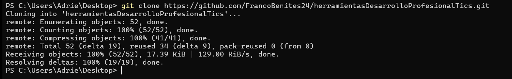

# Instalación local

1. Tener Docker Desktop instalado y corriendo.
2. Clonar este repositorio.
3. Ejecutar: `docker compose up -d`
4. Abrir http://localhost:5678 en el navegador.
5. Crear cuenta de administrador la primera vez.

Para detener el contenedor: `docker compose down`
Para ver logs: `docker compose logs -f n8n`

### 1. Clonacion del repo
> 
> 
