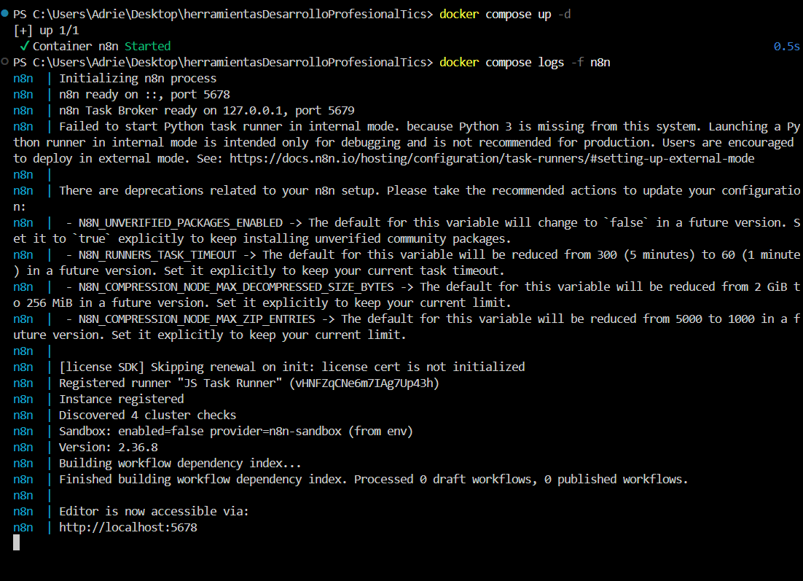
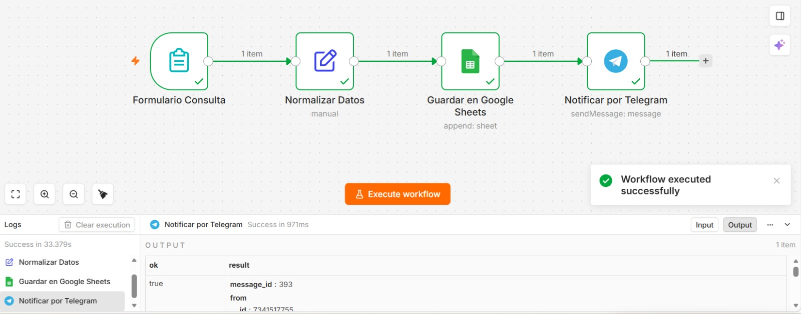
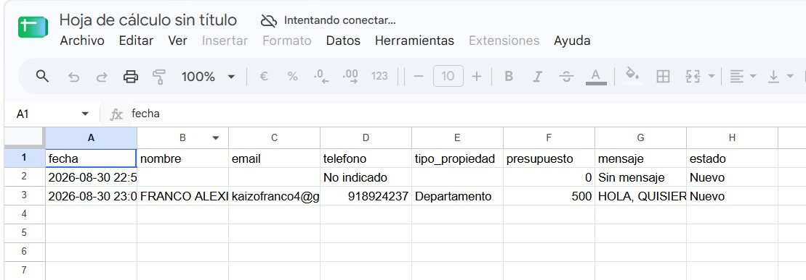
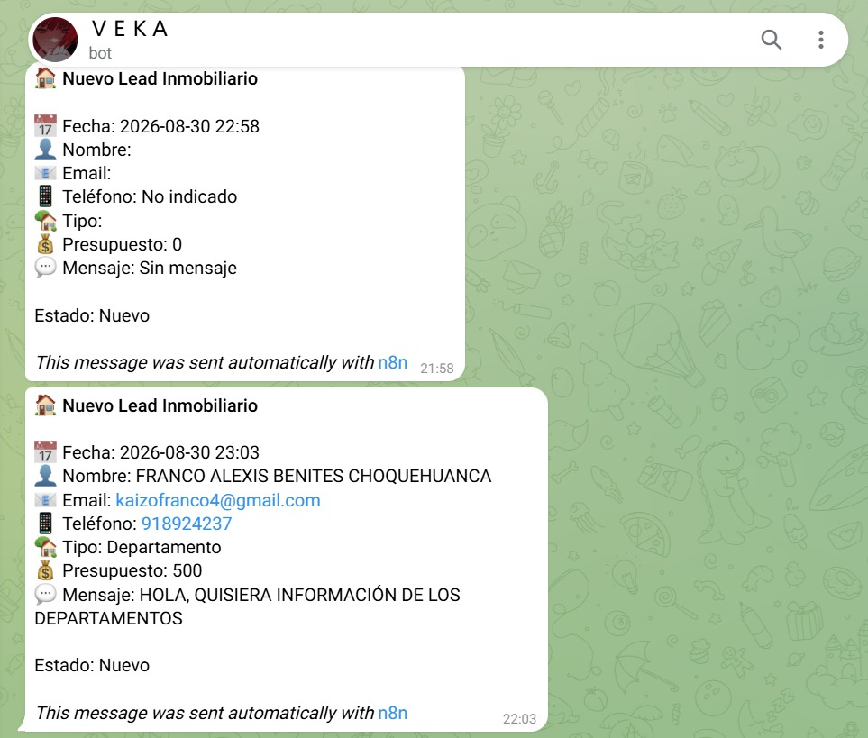

# Automatización de Captura de Leads Inmobiliarios con n8n, Docker y GitHub Flow

Sistema de automatización para la recepción, procesamiento, almacenamiento y notificación en tiempo real de clientes potenciales (leads) del sector inmobiliario, desplegado sobre contenedores **Docker** y gestionado con la estrategia **GitHub Flow**.

---

## Integrantes y Distribución de Roles

| Integrante | Rol Asignado | Responsabilidad Principal | Rama de Trabajo |
| :--- | :--- | :--- | :--- |
| **Grabiel Carnero** | **Integrante 1**: Infraestructura Docker | Creación de `docker-compose.yml`, configuración de `.gitignore`, persistencia con volúmenes y auto-importación. | `feature/GrabielCarnero` |
| **Joshelyn Ruiz - Franco Benites** | **Integrante 2**: Diseño del Workflow n8n | Construcción del flujo en n8n, modularización en 4 nodos y exportación de archivos JSON progresivos. | `feature/joshelynruiz`, `feature/franco` |
| **Adriel Ynfante** | **Integrante 3**: Pruebas y Documentación | Elaboración del `README.md`, diseño de datos de prueba, registro de incidencias y matriz de errores. | `feature/adriel` |

---

## Descripción del Flujo Automatizado (Workflow)

El flujo implementado resuelve el proceso de prospección comercial inmobiliaria conectando **4 nodos** encadenados:

```text
[ Formulario Consulta ] ──▶ [ Normalizar Datos ] ──▶ [ Google Sheets ] ──▶ [ Telegram ]
```

1. **Formulario Consulta (`n8n-nodes-base.formTrigger`):**
   - Publica un formulario web público donde el cliente ingresa: Nombre completo, Email, Teléfono/WhatsApp, Tipo de propiedad (Casa, Departamento, Terreno, Local Comercial), Presupuesto estimado (USD) y Mensaje o comentarios.
   - Configurado con `responseMode: "lastNode"` para notificar al usuario cuando el procesamiento finalice con éxito.
2. **Normalizar Datos (`n8n-nodes-base.set`):**
   - Estandariza los nombres de las variables, genera una marca de tiempo (`fecha`) con formato `yyyy-MM-dd HH:mm` y añade un estado inicial `Nuevo`.
3. **Guardar en Google Sheets (`n8n-nodes-base.googleSheets`):**
   - Registra de forma persistente cada nuevo lead como una fila en la hoja de cálculo de gestión comercial.
4. **Notificar por Telegram (`n8n-nodes-base.telegram`):**
   - Envía una alerta inmediata con formato Markdown al canal o chat del equipo de asesores de ventas con el resumen del prospecto.

---

## Estructura del Repositorio

```text
├── .env.example                   # Plantilla de variables de entorno
├── .gitignore                     # Exclusión de archivos sensibles y temporales
├── docker-compose.yml             # Despliegue de n8n con volumen y auto-carga
├── README.md                      # Documentación integral del proyecto
├── docs/
│   └── capturas/                  # Evidencias visuales de ejecución y pruebas
└── workflows/
    ├── formulario-inicial.json    # Hito 1: Estructura base del formulario
    ├── formulario-sheets.json     # Hito 2: Integración con base de datos en Sheets
    └── formulario-completo.json   # Hito 3: Flujo final completo (con Telegram)
```

---

## Guía de Instalación y Despliegue Local

### 1. Prerrequisitos
- [Docker Desktop](https://www.docker.com/products/docker-desktop/) instalado y en ejecución.
- [Git](https://git-scm.com/) instalado en el sistema.

### 2. Pasos para levantar el servicio

```bash
# 1. Clonar el repositorio
git clone https://github.com/FrancoBenites24/herramientasDesarrolloProfesionalTics.git

# 2. Entrar a la carpeta del proyecto
cd herramientasDesarrolloProfesionalTics

# 3. Iniciar el contenedor en segundo plano
docker compose up -d
```

### 3. Acceso a n8n
Abre tu navegador web e ingresa a: `http://localhost:5678`

*(Se configuró `N8N_USER_MANAGEMENT_DISABLED=true` para ingresar directamente a la interfaz de trabajo sin requerir registro de credenciales ni cuestionarios iniciales).*

### 4. Flujos Precargados y Persistencia
- Gracias al comando de auto-importación configurado en `docker-compose.yml`, los flujos ubicados en `./workflows` se inyectan automáticamente en la base de datos interna SQLite de n8n al arrancar.
- El volumen nombrado `n8n_data:/home/node/.n8n` asegura que las credenciales (Google OAuth / Bot de Telegram) y el historial de ejecuciones se mantengan guardados de forma persistente aunque se detenga o reinicie el contenedor (`docker compose down`).

---

## Carga de Datos de Prueba

Para validar el flujo de extremo a extremo, se diseñaron y enviaron los siguientes casos de prueba mediante el formulario público:

### Caso de Prueba 1: Prospecto Residencial (Éxito)
- **Nombre:** Carlos Mendoza
- **Email:** `cmendoza.test@gmail.com`
- **Teléfono:** `+51 987654321`
- **Tipo de Propiedad:** Departamento
- **Presupuesto:** `85000`
- **Mensaje:** "Interesado en departamentos de 2 habitaciones en San Miguel."
- **Resultado Esperado:** Fila registrada en Google Sheets y mensaje recibido en el bot de Telegram con estado `Nuevo`.

### Caso de Prueba 2: Prospecto Comercial (Éxito)
- **Nombre:** Lucía Fernández
- **Email:** `lucia.f@empresa.pe`
- **Teléfono:** `+51 912345678`
- **Tipo de Propiedad:** Local Comercial
- **Presupuesto:** `150000`
- **Mensaje:** "Busco local en primer piso para tienda de tecnología."
- **Resultado Esperado:** Notificación inmediata con formato estructurado en Telegram y guardado sin errores en Google Sheets.

---

## Evidencias de Ejecución (Capturas de Pantalla)

*(Las capturas se alojan en la carpeta `docs/capturas/` para su referencia visual)*

### 1. Docker Desktop en Ejecución
> Contenedor de n8n corriendo activamente en el puerto `5678` con volumen persistente `n8n_data`.
> 
> 

### 2. Flujo Completo Activo en n8n
> Vista del lienzo de n8n mostrando los 4 nodos conectados y con ejecución exitosa (check verde en cada nodo).
> 
> 

### 3. Registro en Google Sheets
> Visualización de la hoja de cálculo con las filas insertadas automáticamente por los casos de prueba.
> 
> 

### 4. Alerta en Canal de Telegram
> Mensaje con formato Markdown recibido por el bot con todos los detalles del prospecto.
> 
> 

---

## Matriz de Errores, Causa Raíz y Soluciones (Troubleshooting)

| # | Problema / Incidencia | Causa Raíz | Solución Aplicada |
| :-: | :--- | :--- | :--- |
| **1** | `Bind for 0.0.0.0:5678 failed: port is already allocated` al ejecutar `docker compose up`. | El puerto `5678` estaba ocupado por otra instancia previa de n8n o un servicio en segundo plano. | Se buscó el proceso con `netstat -ano \| findstr :5678` para detenerlo con `taskkill /PID <id> /F`, o se mapeó a un puerto libre alternativo (`5679:5678`) en `docker-compose.yml`. |
| **2** | Las credenciales y los flujos modificados se borraban al reiniciar el contenedor (`docker compose down`). | El contenedor era efímero porque inicialmente no se había definido un volumen persistente para la base de datos de n8n. | Se agregó la directiva `volumes: - n8n_data:/home/node/.n8n` en el archivo `docker-compose.yml` para garantizar persistencia local. |
| **3** | `ERROR: Cannot read properties of undefined (reading 'Nombre completo')` en el nodo Set. | Los campos del formulario contenían espacios y caracteres especiales, por lo que la notación de punto (`$json.Nombre completo`) generaba error de sintaxis JSON. | Se corrigió la expresión utilizando notación de corchetes con comillas: `={{ $json['Nombre completo'] }}`. |
| **4** | Error `401 Unauthorized` al conectar el nodo de Telegram. | El Token del bot de Telegram estaba mal copiado o contenía espacios en blanco invisibles. | Se volvió a generar el token en `@BotFather`, se verificó el Chat ID del usuario receptor y se guardaron las credenciales en n8n. |
| **5** | El formulario web se quedaba cargando indefinidamente tras enviar los datos. | El nodo trigger estaba configurado con modo de respuesta por defecto en lugar de esperar la finalización de los nodos siguientes. | Se cambió el parámetro `responseMode` a `"lastNode"`, permitiendo que el formulario devuelva la confirmación tras ejecutar el guardado en Sheets y el envío a Telegram. |

---

## Explicación de Errores en Nuestras Propias Palabras (Aprendizaje del Taller)

Durante el desarrollo de esta tarea académica, nos enfrentamos a situaciones comunes de principiantes. A continuación explicamos 2 de los errores más importantes y cómo los resolvimos:

### 1. Error de Sintaxis al acceder a campos con espacios en n8n (`$json['Campo']` vs `$json.Campo`)
- **Qué nos pasó:** Al momento de recibir los datos del formulario en el nodo *Normalizar Datos*, queríamos extraer el nombre y el tipo de propiedad. Intentamos escribir la expresión como `{{ $json.Nombre completo }}` y `{{ $json.Tipo de propiedad de interés }}`. Al ejecutar el nodo, n8n nos arrojaba un error de JavaScript indicando que la propiedad era indefinida (`undefined`) o que la sintaxis era inválida.
- **Por qué ocurrió:** En JavaScript y JSON, cuando el nombre de una clave tiene espacios o caracteres especiales (como tildes o barras `/`), no se puede usar la notación de punto (`objeto.propiedad`).
- **Cómo lo resolvimos:** Investigamos la documentación de n8n y cambiamos la sintaxis a notación de corchetes con comillas: `{{ $json['Nombre completo'] }}` y `{{ $json['Teléfono / WhatsApp'] }}`. De esta manera, n8n pudo leer perfectamente los valores ingresados por el usuario.

### 2. Error de Puerto Ocupado en Docker (`port is already allocated`)
- **Qué nos pasó:** Al ejecutar el comando `docker compose up -d` en la terminal, Docker nos devolvió un mensaje de error en rojo diciendo `Error response from daemon: Ports are not available: exposing port TCP 0.0.0.0:5678 -> 0.0.0.0:0: listen tcp 0.0.0.0:5678: bind: Only one usage of each socket address is normally permitted`.
- **Por qué ocurrió:** Uno de nosotros había dejado una sesión de n8n corriendo en Node.js de forma nativa en la máquina, y en otra prueba se había creado un contenedor previo sin detenerse, reteniendo el puerto `5678`.
- **Cómo lo resolvimos:** Abrimos la terminal PowerShell y ejecutamos `netstat -ano | findstr :5678` para ubicar el número de proceso (PID) que tenía tomado el puerto. Vimos cuál era y lo detuvimos con `taskkill /PID <numero> /F`. Luego volvimos a correr `docker compose up -d` y el contenedor levantó sin ningún inconveniente.

---

## Flujo de Trabajo y Peer Review (GitHub Flow)

Para cumplir con la política de ramas protegidas y colaboración:
1. Cada integrante creó su propia rama (`feature/nombre-alumno`).
2. Se realizaron commits progresivos y atómicos por cada funcionalidad.
3. Para fusionar a `main`, se abrió un **Pull Request (PR)** donde otro integrante probó y validó los cambios usando la plantilla obligatoria:

```markdown
### Comentario de revisión:
- **¿Probé la configuración en mi máquina local?**: [Sí]
- **¿Qué funcionó correctamente?**: Se levantó el contenedor con Docker Compose y el flujo importó automáticamente los nodos de Sheets y Telegram sin errores.
- **¿Encontré algún detalle o fallo?**: Ninguno, los datos de prueba se guardaron correctamente en la hoja de cálculo.
```
